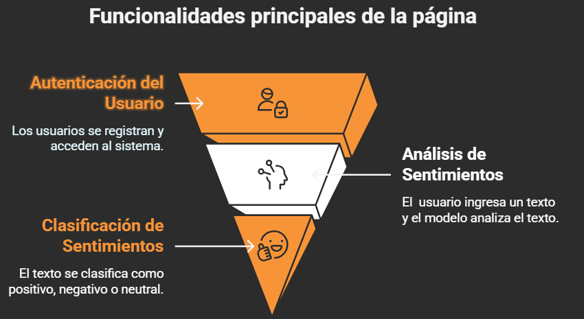
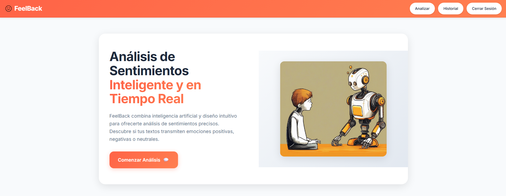
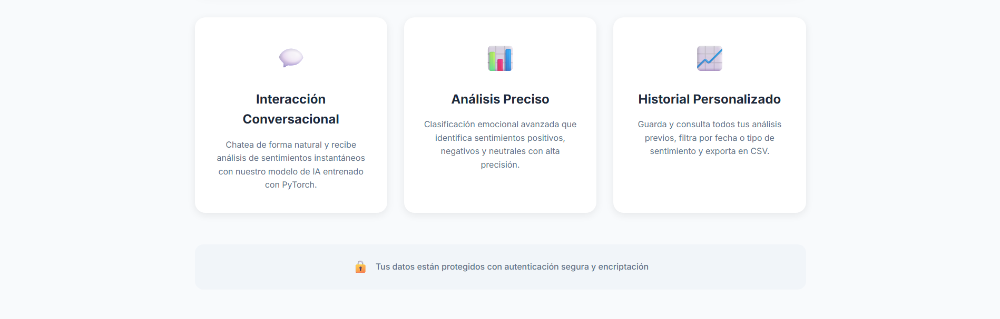
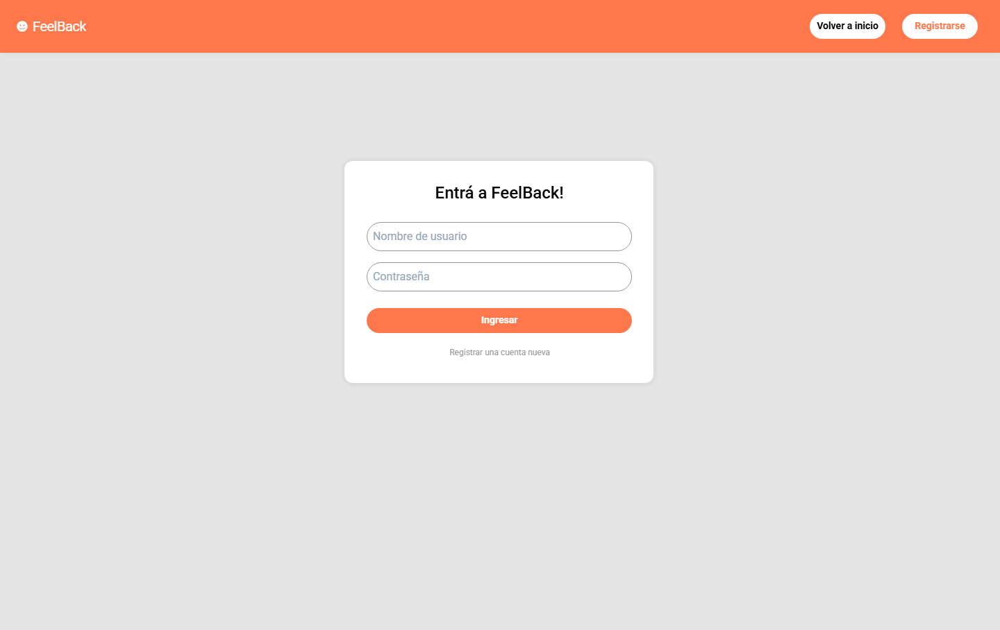
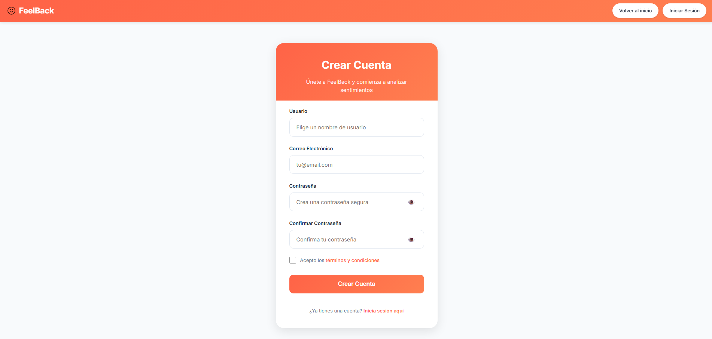
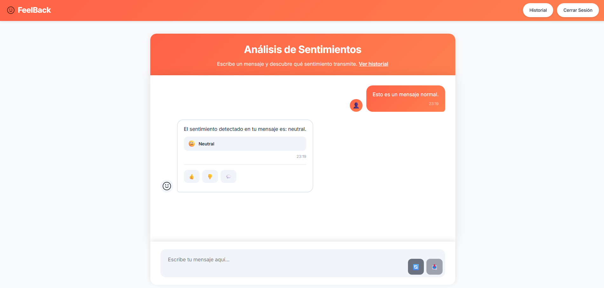
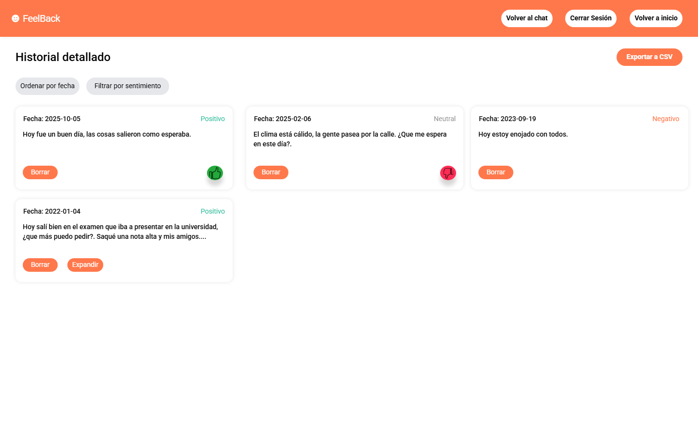
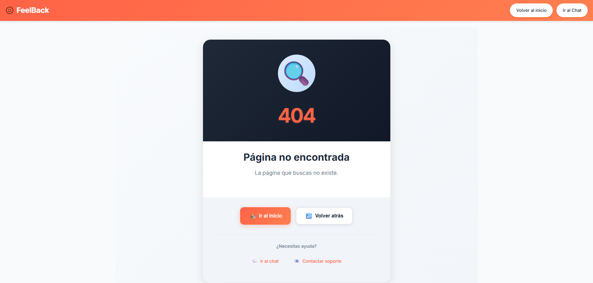

# FeelBack: Aplicación Web Interactiva para Análisis de Sentimientos

| Estado de Build | Cobertura de Tests |
|:--------------:|:------------------:|
|  |  |

## Índice
- [Descripción](#descripción)
- [Tecnologías Utilizadas](#-tecnologías-utilizadas)
- [Funcionalidades Principales](#-funcionalidades-principales)
- [Estructura del Proyecto](#-estructura-del-proyecto)
- [Endpoints de la API](#-endpoints-de-la-api)
- [Dockerización](#-dockerización)
- [Capturas de pantalla](#-capturas-de-pantalla)
- [Contribución](#-contribución)
- [Licencia](#-licencia)

---

## Descripción
**FeelBack** es una aplicación web que combina inteligencia artificial y un diseño intuitivo para ofrecer análisis de sentimientos en tiempo real. Los usuarios pueden interactuar con un modelo de aprendizaje automático extraido de [**HuggingFace**](https://huggingface.co/nlptown/bert-base-multilingual-uncased-sentiment) a través de una interfaz tipo chat, obteniendo clasificaciones emocionales como **positiva**, **negativa** o **neutral**. Además, la aplicación permite a los usuarios gestionar su historial de análisis y explorar sus resultados de manera organizada.

## 🚀 Tecnologías Utilizadas
- **Lenguaje de programación:** Python
- **Framework Backend:** Flask
- **Modelo de ML:** BERT Multilingüe (nlptown/bert-base-multilingual-uncased-sentiment) de HuggingFace
- **Librería de inferencia:** Transformers (HuggingFace)
- **Base de datos:** PostgreSQL
- **Contenerización:** Docker y Docker Compose

## 🧩 Funcionalidades Principales



1. **Gestión de Usuarios**  
   - Sistema de registro e inicio de sesión para proteger los datos personales de cada usuario.
   - Cada usuario tiene acceso a su historial de análisis.
2. **Interacción Conversacional**  
   - Los usuarios pueden escribir comentarios en una interfaz tipo chat y recibir análisis de sentimientos en tiempo real.
   - El modelo clasifica el texto en positivo, negativo o neutral.
3. **Historial Personalizado**  
   - Los usuarios pueden consultar sus análisis previos, filtrarlos por fecha o tipo de sentimiento, y exportarlos en formato CSV.

## 📚 Estructura del Proyecto
```bash
FeelBack/
├── web_app/                    # Aplicación web (Frontend + API Backend)
│   ├── app/                    # Código fuente de la aplicación Flask
│   │   ├── api/                # API RESTful: rutas para autenticación, chat y usuario
│   │   ├── auth/               # Módulo de autenticación (formularios, rutas web)
│   │   ├── main/               # Módulo principal (chat, historial, vistas web)
│   │   ├── models/             # Modelos de datos (ORM)
│   │   ├── static/             # Archivos estáticos (CSS, JS, imágenes)
│   │   ├── templates/          # Plantillas HTML (Jinja2)
│   │   ├── utils/              # Utilidades compartidas
│   │   ├── __init__.py         # Inicialización y configuración de la aplicación Flask
│   │   └── config.py           # Configuración general de la aplicación
│   ├── Dockerfile              # Contenedor para la aplicación web
│   ├── migrations/             # Migraciones de base de datos
│   ├── tests/                  # Pruebas unitarias de la API y lógica
│   ├── requirements.txt        # Dependencias de la aplicación web
│   ├── run.py                  # Punto de entrada para ejecutar la aplicación
│   └── setup.py                # Configuración del paquete
├── img/                        # Imágenes para documentación
├── docker-compose.yml          # Orquestación de servicios
└── README.md                   # Documentación principal del proyecto
```

## 📖 Endpoints de la API
A continuación se listan las rutas principales de la API RESTful expuesta por FeelBack agrupadas por funcionalidad:

### Autenticación (`/api/v1/auth`)
- **POST `/register`**: Registra un nuevo usuario.  
  _Body_: username, email, password  
  _Respuesta_: Mensaje de éxito o error.

- **POST `/login`**: Inicia sesión y retorna un token JWT.  
  _Body_: username, password  
  _Respuesta_: token, user_id.

- **POST `/verify-token`**: Verifica la validez de un token JWT.  
  _Body_: token  
  _Respuesta_: Mensaje de validez y user_id.

### Chat y Análisis de Sentimientos (`/api/v1/chat`)
- **POST `/get-sentiment`**: Analiza el sentimiento de un mensaje de texto.  
  _Body_: message  
  _Respuesta_: model_response (texto), id_sentiment (código de sentimiento).

### Gestión de Mensajes e Historial (`/api/v1/user`)
- **POST `/save-message`**: Guarda un mensaje analizado en el historial del usuario.  
  _Body_: user_id, text, id_sentiment, liked  
  _Respuesta_: Mensaje de éxito y id_message.

- **POST `/delete-message`**: Elimina un mensaje del historial del usuario.  
  _Body_: user_id, message_id  
  _Respuesta_: Mensaje de éxito.

- **GET `/get-message`**: Obtiene un mensaje específico del historial.  
  _Body_: user_id, message_id  
  _Respuesta_: Detalles del mensaje.

- **GET `/get-messages`**: Obtiene todos los mensajes del usuario.  
  _Body_: user_id  
  _Respuesta_: Lista de mensajes.

- **GET `/get-stats`**: Obtiene estadísticas de uso y sentimientos del usuario.  
  _Body_: user_id  
  _Respuesta_: Conteo de positivos, negativos, neutrales, likes y dislikes.

Estas rutas permiten la integración con sistemas de monitoreo y dashboards de salud.

#### Notas adicionales
- Todas las rutas protegidas requieren autenticación mediante token JWT en el header `Authorization: Bearer <token>`.

## 🐳 Dockerización
FeelBack está completamente contenerizado para facilitar su despliegue y escalabilidad. Los servicios están orquestados mediante Docker Compose:
```bash
# Construcción de los contenedores
docker-compose build
# Ejecución de los servicios
docker-compose up
```

## 📷 Capturas de pantalla
### Página de Inicio
Pantalla de bienvenida con logo, mensaje introductorio y acceso rápido a registro o inicio de sesión. Diseño limpio, modular y responsivo.




### Página de Inicio de Sesión
Formulario sencillo para autenticación de usuarios, con validación y mensajes de error claros.



### Página de Registro
Formulario para crear una cuenta nueva, validación en tiempo real y confirmación de términos.



### Página de Interacción (Chat)
Interfaz tipo chat para analizar sentimientos en tiempo real. Mensajes diferenciados y feedback visual.




### Página de Historial
Historial de análisis con estadísticas, filtros, exportación a CSV y visualización clara de cada mensaje.



### Página de Error
Página que se muestra en casos de presentar errores en la aplicación.



## 🤝 Contribución
¡Las contribuciones son bienvenidas! Por favor, abre un issue o pull request siguiendo las buenas prácticas de la comunidad.

## 📝 Licencia
Este proyecto está bajo la Licencia MIT.