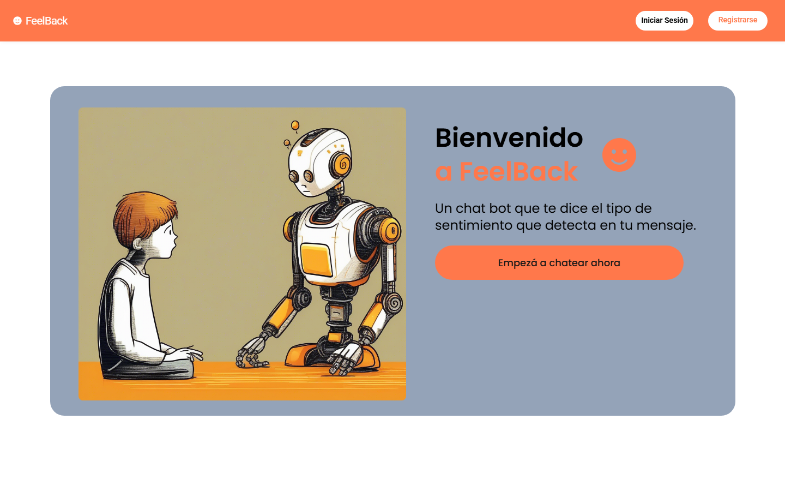
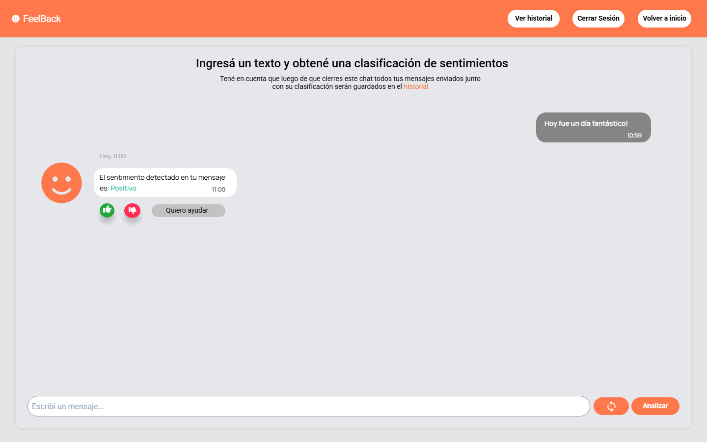

# FeelBack: Aplicación Web Interactiva para Análisis de Sentimientos

**FeelBack** es una aplicación web interactiva desarrollada con Python, cuyo propósito es permitir a los usuarios escribir comentarios o reseñas de texto y obtener un análisis automático de su sentimiento utilizando un modelo de aprendizaje automático entrenado con **PyTorch**. La clasificación del texto puede ser **positiva**, **negativa** o **neutral**.

El sistema incluye autenticación básica para que los usuarios puedan iniciar sesión y visualizar su historial personal de análisis. La interfaz está compuesta por dos vistas principales: un formulario de acceso (login/registro) y una página tipo chat donde se realiza el análisis de sentimientos.

## 🚀 Tecnologías Utilizadas

- **Lenguaje de programación:** Python
- **Framework Backend:** Flask
- **Base de datos:** PostgreSQL
- **Modelo de ML:** PyTorch
- **Contenerización:** Docker, Docker Compose

## 🧩 Funcionalidades Principales


1. **Registro y Login de Usuarios**
   - Formulario de registro e inicio de sesión.
   - Validación y autenticación básicas para proteger los datos de cada usuario.

2. **Análisis de Sentimientos**
   - Interfaz tipo chat para ingresar comentarios.
   - Modelo entrenado en PyTorch que devuelve una clasificación del sentimiento.

3. **Historial Personal**
   - Cada usuario puede consultar los resultados anteriores de sus análisis.

## 📚 Estructura del Proyecto

```bash
sentiment_app/
├── app/
│   ├── routes/           # Rutas de la API (login, registro, análisis, historial)
│   ├── templates/        # HTMLs: login, registro, chat
│   ├── static/           # CSS
│   ├── model/            # Modelo PyTorch, inferencia y preprocesamiento
│   ├── db/               # Conexión y lógica de base de datos
│   └── utils/            # Autenticación y utilidades
├── saved_models/         # Modelo entrenado (.pt)
├── run.py                # Punto de entrada para la app Flask
├── setup.py               
├── .gitignore            
├── requirements.txt      # Dependencias del proyecto
├── Dockerfile            # Imagen Docker para Flask
├── docker-compose.yml    # Servicio Flask + PostgreSQL
└── README.md
````

## 📡 Endpoints de la API

| Endpoint    | Método | Descripción                                 |
| ----------- | ------ | ------------------------------------------- |
| `/register` | POST   | Registro de nuevos usuarios                 |
| `/login`    | POST   | Inicio de sesión                            |
| `/analyze`  | POST   | Enviar comentario y recibir análisis        |
| `/history`  | GET    | Consultar historial de análisis del usuario |


## 🐳 Dockerización

El proyecto incluye archivos de configuración para contenerizar la aplicación:

* `Dockerfile`: Define la imagen para el servicio Flask.
* `docker-compose.yml`: Orquesta los servicios Flask y PostgreSQL.

```bash
# Construcción del contenedor
docker-compose build

# Ejecución
docker-compose up
```

## 📷 Capturas de pantalla 

### Página de Inicio
La página de inicio presenta la interfaz de autenticación donde los usuarios pueden registrarse o iniciar sesión. Incluye formularios intuitivos con validación de campos y un diseño limpio que facilita el acceso al sistema.



**Componentes principales:**
- **Formulario de Login**: Campos para email y contraseña con validación en tiempo real
- **Formulario de Registro**: Campos para crear una nueva cuenta de usuario
- **Navegación**: Pestañas para alternar entre las opciones de login y registro
- **Validación**: Mensajes de error y confirmación para guiar al usuario
- **Diseño Responsivo**: Interfaz adaptable a diferentes tamaños de pantalla

### Página de Interacción
La página principal de la aplicación presenta una interfaz tipo chat donde los usuarios pueden ingresar sus comentarios y recibir análisis de sentimientos en tiempo real. El diseño intuitivo permite una experiencia de usuario fluida y natural.



**Componentes principales:**
- **Área de Chat**: Interfaz conversacional para ingresar comentarios y ver respuestas
- **Panel de Resultados**: Muestra la clasificación del sentimiento (positivo, negativo, neutral)
- **Historial de Análisis**: Lista cronológica de análisis previos del usuario
- **Indicadores Visuales**: Colores y iconos que representan cada tipo de sentimiento
- **Campo de Entrada**: Área de texto para escribir comentarios a analizar
- **Botón de Análisis**: Envía el texto al modelo de PyTorch para su procesamiento
- **Opciones de Usuario**: Navegación y logout para gestión de sesión